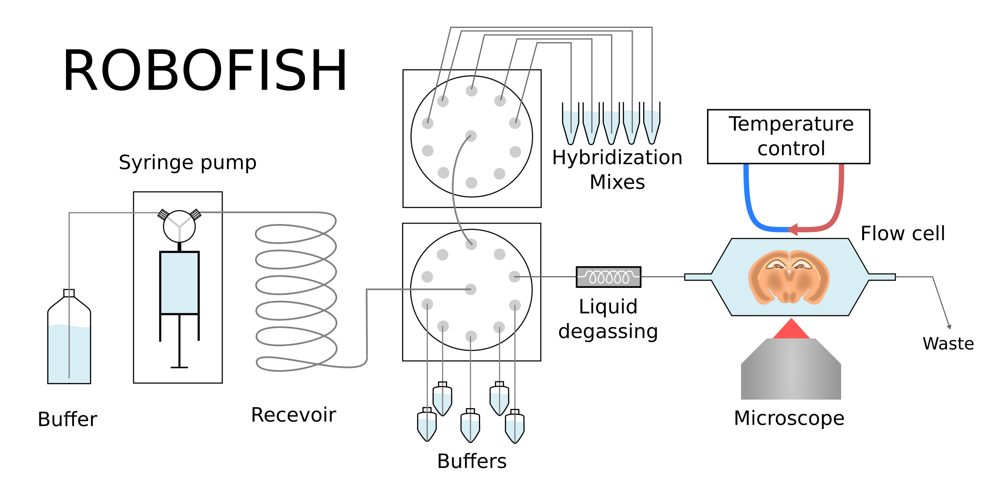

# ROBOFISH
Code and installation instructions for the ROBOFISH system. Which is a fully automated, liquid-handling and temperatrue control machine that can be integrated with imaging for automated (cyclic) staining protocols of biological samples, like cyclic single molecule Fluorescent in situ hybridization (smFISH).

# Publication
The ROBOFISH system was published as part of the EEL method: [link]()  UPDATE LINK!!!!!
Please cite this paper when using the ROBOFISH system, thank you!

# Description
The ROBOFISH system is an open-source fully automated fluidics and temperature control platform that is integrated with imaging. It is designed to dispense arbitrarily small volumes to the flow cell that holds the sample, by bridging the dead volume so that costly solutions like probe mixes or antibodies are not wasted. It is designed to be flexible, both in terms of components and in desired protocols and should be able to perform most staining protocols that require control of liquids, timing, temperature and imaging. It is constructed of a syringe pump with a Y-valve that is connected to the running buffer, in our case 2X SSC, and a reservoir tube. The syringe pump can either be the Tecan Cavro XE 1000 or Cavro XCalibur. The reservoir tube is connected to two 10-port actuated valves (MX-II IDEX) that are connected to the various buffers, up to two flow cells and the waste.  

This setup enables the aspiration of the target buffer into the reservoir, after which extra running buffer is aspirated into the syringe pump, so that when dispensed the extra volume bridges the dead volume between valve and flow cell. Between the valve and flow cell a bubble-trap (Elveflow) and liquid degasser (Degasi Biotech) ensure that no air enters the flow cell. The flow cell itself can either be a flow cell designed by Rebus Biosystems which is temperature controlled by the TE Technology Inc. TC-720, or the FCS2 flow cell from Bioptechs that can either be temperature controlled by the Solid State Oasis or the Solid State ThermoCube recirculating chillers. In the case of the FCS2 flow cell, temperature monitoring is implemented with the Yoctopuce Thermistor that reads and logs the temperature.  

The ROBOFISH system keeps track of buffer volumes and notifies the user by push-messages when buffers need to be replaced. This is also the case for any other errors or aberrant temperatures in the system or room. The full protocol is written to log files and metadata files so that image datasets are accompanied by all relevant data on sample, procedure, gene-targets and timing.

# Building instructions
Full building instructions are available on Protocols.io [here](https://www.protocols.io/edit/robofish-construction-bcrciv2w) UPDATE LINK!!!!!

# Installation
Instructions to install and operate ROBOFISH can be found [here](https://github.com/linnarsson-lab/ROBOFISH/blob/master/Instalation.md)

# EEL protocol
To perform the EEL protocol please follow the installation instructions and use the [EEL notebook](https://github.com/linnarsson-lab/ROBOFISH/blob/master/EEL.ipynb) with the pre-loaded protocol.

# Custom protocol
The [geting started notebook]() will help you design and run your own protocols on the ROBOFISH system. 
